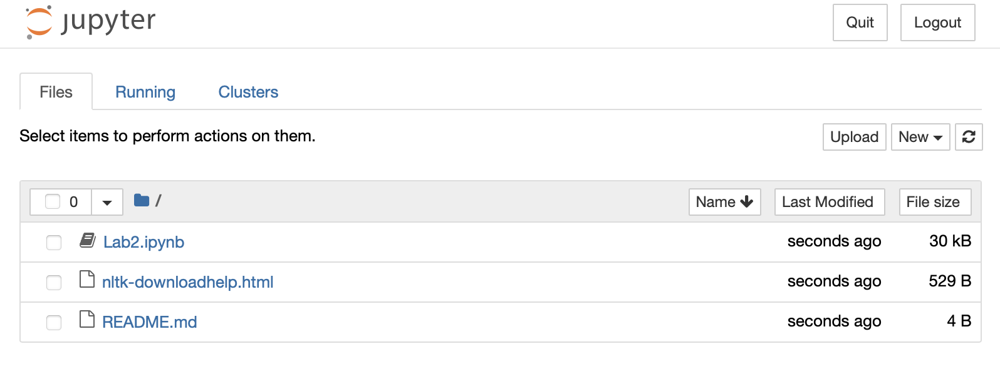

# Lab 2: nltk and spaCy

---

### REMINDER: You are using GitHub Classroom to submit your assignments for this class
**First**, clone this repo down to your own machine. Here's how: (1) Click the green `Code` button. (2) Make sure HTTPs is underlined, then click the copy icon. (3) Launch a terminal, and type ``git clone`` then paste in what you copied in step 2. **Next,** finish reading this README file to complete your environment setup. **Finally,** complete the lab in the jupyter notebook on your own computer, as described below. When you're done you'll add, commit, and push your notebook to your repo.

---

In this lab, you'll be learning how to use the nltk library to carry out text normalization and do some basic text analysis. At the very end, you'll use a different library, spaCy, which will allow you to do much of this normalization in a more streamlined but less transparent way. 

The lab will be entirely contained within a jupyter notebook. If you have never used one before, don't worry! This lab will walk you through using jupyter.

Depending on how you installed Python 3.9 and what you have done before, it's possible that you are going to need to install some stuff. Please review the material below.

### Part 1: Install nltk and spaCy for your Python 3.9

**With Anaconda:** Anaconda has a GUI library manager within the Anaconda navigator that you can use to install these libraries. You can probably just point and click your way through that, or you can Google how to do it. I recently installed Anaconda on my Mac, and nltk was already installed. A TA had trouble using the package manager to install spaCy, so your mileage may vary. 

Alternatively, you should be able to install the libraries with the conda package manager from the command line, like so:

```conda install -c anaconda nltk```

```conda install -c conda-forge spacy```

A TA also had trouble with `conda`, so if that doesn't work, you might have luck using `pip3`, as described below.

**Without Anaconda:** You can just use pip, like so. (You can just use ``pip3``, but I like to use ``python3 -m pip`` so I can be 100% sure that I am installing the libraries for the verion of Python I plan to use.)

```python3.9 -m pip install nltk```

```python3.9 -m pip install spacy```

### Part 2: Make sure you can launch jupyter notebook *within Python 3.9*.

**With Anaconda:** If you have Anaconda with Python 3.9, then you most likely have jupyter already. You can launch jupyter notebook in one of two ways. (1) Launch Anaconda Navigator, then click the Jupyter Notebook launch button. **OR** (2) If you installed Anaconda recently, its version of jupyter should be the one you can launch from a command line. Open a terminal, and type ``which jupyter``. If the path it prints out includes the word "Anaconda" and "3.9" it in somewhere, you should also be able to launch jupyter notebook with Python 3.9 just by typing ```jupyter notebook``` at the command line.

**Without Anaconda:** If you installed Python 3.9 not using Anaconda, you might not have jupyter already, unless you installed it yourself. Open a terminal and type

```which jupyter```

If it gives you a path back that's the same as you get if you type ```which python3```, you are good to go!  Type ``jupyter notebook`` to launch.

If it doesn't give you back anything or if it gives you back a path that's not the same as ```which python3```, then you'll need to (re)install it, like so. (Again, you can  just use ``pip3``, but make sure that ``pip3`` goes with your version of Python 3.9.)

```python3.9 -m pip install jupyter```

Then type ``jupyter notebook`` to launch.

### Part 3: Getting to the ``Lab2.ipynb`` jupyter notebook
Once you have launched jupyter notebook, you should  see a browser window that looks like the one below. If you typed ```jupyter notebook``` from this directory to launch jupyter, you will see the contents of this directory. Click on ```Lab2.ipynb```, which will open the notebook where you will complete the lab.



If you typed the command from a different directory, or if you launched jupyter from Anaconda Navigator, you'll have to click on folders in the browser window to navigate to this directory. Then click on ```Lab2.ipynb```, which will open the notebook where you will complete the lab.

### Part 4: Complete the lab
The notebook describes exactly what you need to do! You will add, commit, and push your version of the filled-in notebook along with anything else the lab requires to this repo as your submission for Lab 2.

*Note: Although jupyter notebook runs in a web browser, it is not actually "on" the internet. It's still just on your computer! You don't need to be connected to the internet to use a jupyter notebook since everything is happening locally.*

**This assignment is due Wednesday, 9/14 @11:59pm EDT**
